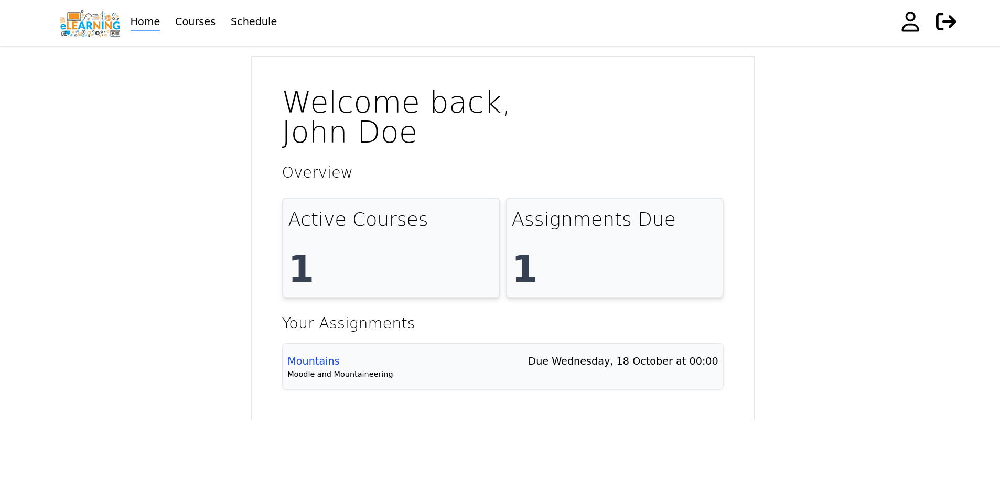
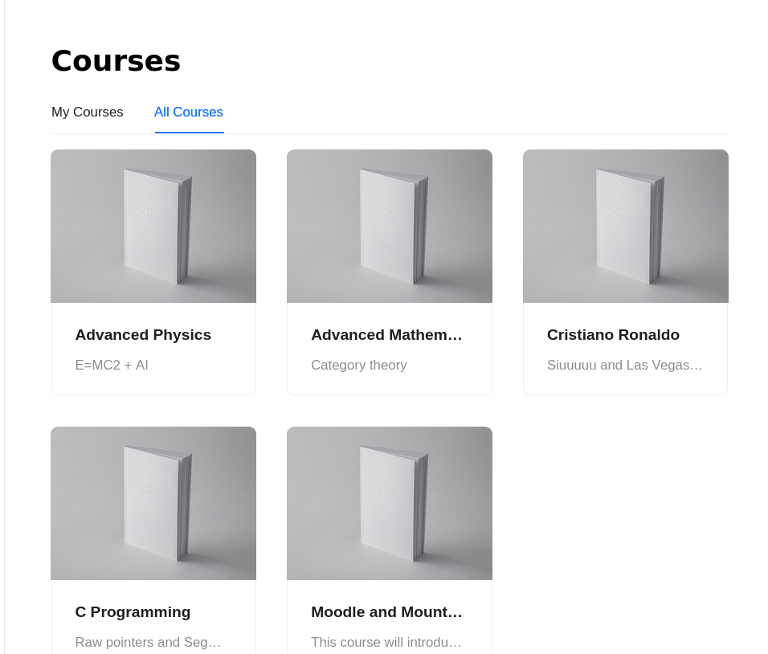
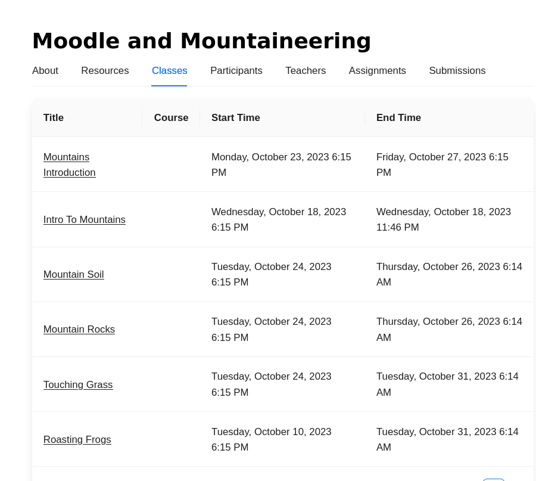
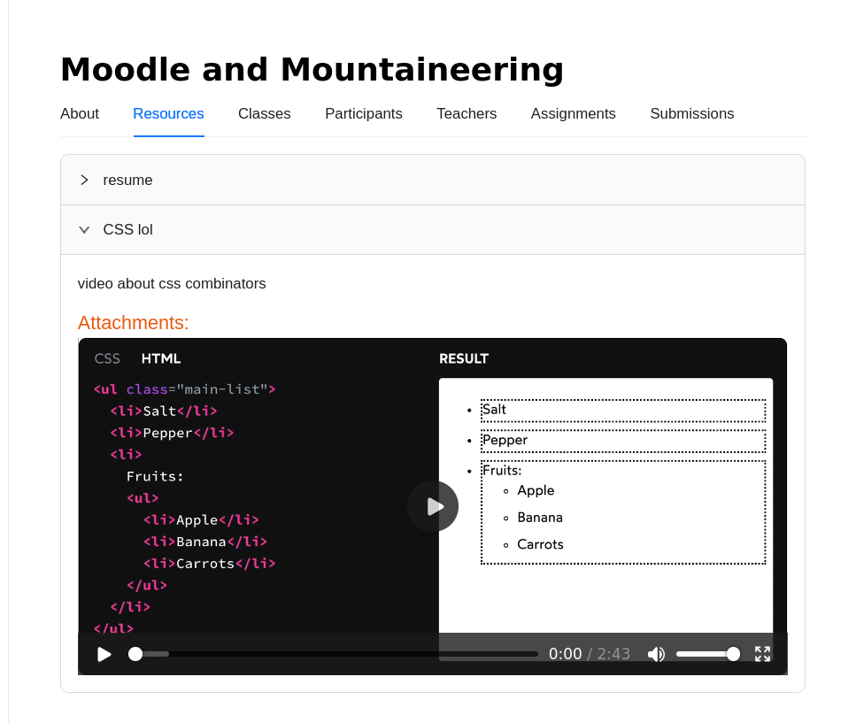
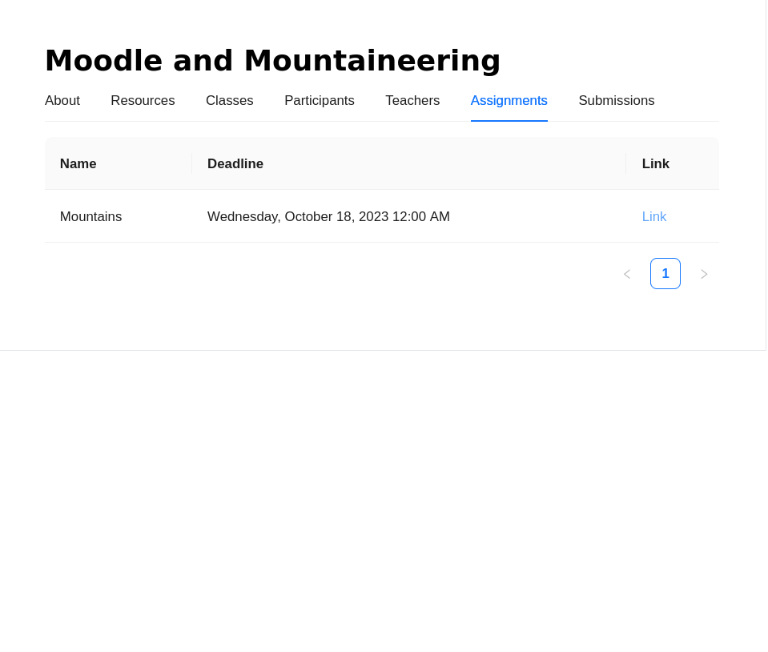

# learning-management-system

# Screenshots







<br />
<br />

# Development
## Client
```bash
cd ./client

npm i 

npm run dev
```

## Server
```bash
cd ./server

# create and run a postgres container
./db.sh

poetry shell

poetry install

uvicorn main:app --reload

```
